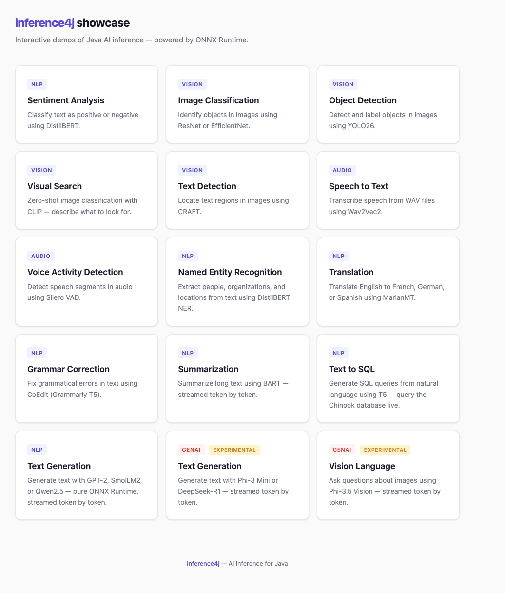

# inference4j showcase

Interactive demos of [inference4j](https://github.com/inference4j/inference4j) — Java AI inference powered by ONNX Runtime.



## Demos

| Demo | Model | Domain |
|------|-------|--------|
| Sentiment Analysis | DistilBERT (SST-2) | NLP |
| Named Entity Recognition | DistilBERT NER | NLP |
| Grammar Correction | CoEdit Base (Grammarly T5) | NLP |
| Translation | MarianMT | NLP |
| Summarization | DistilBART CNN | NLP |
| Text to SQL | T5-small | NLP |
| Text Generation (GPT-2) | GPT-2 / SmolLM2 / Qwen2.5 | NLP |
| Image Classification | ResNet-50 / EfficientNet | Vision |
| Object Detection | YOLO26 (COCO, 80 classes) | Vision |
| Visual Search | CLIP (ViT-B/32) | Vision |
| Text Detection | CRAFT | Vision |
| Speech to Text | Wav2Vec2 | Audio |
| Voice Activity Detection | Silero VAD | Audio |
| Text Generation | Phi-3 Mini / DeepSeek-R1 1.5B | GenAI |
| Vision-Language | Phi-3.5 Vision | GenAI |

## Prerequisites

- Java 17+
- Gradle 9.3+

## Running

```bash
./gradlew bootRun
```

Then open http://localhost:8080.

On first startup, models are downloaded automatically from Hugging Face and cached locally. This may take a few minutes depending on your connection.

### Running from an IDE

inference4j uses ONNX Runtime which requires native access. When running via `./gradlew bootRun`, the JVM flag is set automatically. When running the `main()` method directly from an IDE (IntelliJ, Eclipse, etc.), you need to add this VM option to your run configuration:

```
--enable-native-access=ALL-UNNAMED
```

In IntelliJ: **Run > Edit Configurations > Modify options > Add VM options**, then paste the flag.

Alternatively, configure your IDE to delegate run/debug to Gradle (**Settings > Build, Execution, Deployment > Build Tools > Gradle > Build and run using: Gradle**), which picks up the `bootRun` JVM args automatically.

## Stack

- Spring Boot 4.0
- [inference4j](https://github.com/inference4j/inference4j) 0.10.0 (Spring Boot starter + core + genai)
- Vanilla HTML/CSS/JS (no frontend framework)
